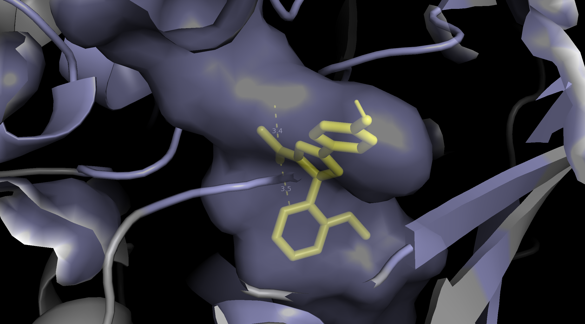
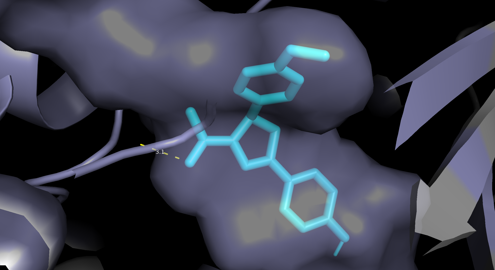
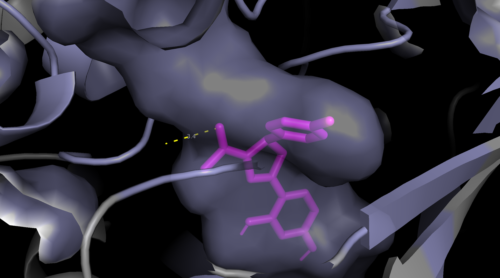

# MAO-A Inhibitor Discovery- A Computational Drug Discovery Pipeline

An end-to-end computational drug discovery workflow targeting Monoamine Oxidase A (MAO-A), a key enzyme implicated in depression and anxiety disorders.

This project integrates:

* Cheminformatics  
* Machine learning  
* Molecular docking  
* ADMET filtering

to identify potential MAO-A inhibitor candidates.

# **Project Overview-**

## **Target Information**

· Target: MAO-A (CHEMBL1951 / UniProt P21397)

· Protein Structure: PDB ID 2Z5X (human MAO-A) 

# **Workflow-**

ChEMBL Data Collection

↓

Data Cleaning & pIC50 Conversion

↓

RDKit Descriptor Extraction

↓

Morgan Fingerprint Generation

↓

Random Forest Regression

↓

Top Molecule Selection

↓

Lipinski Filtering

↓

3D Conformer Generation

↓

Molecular Docking (AutoDock Vina)

↓

ADMET Evaluation

# **Machine Learning-**

Molecular descriptors and 2048-bit Morgan fingerprints (ECFP4) were generated using RDKit and used to train a Random Forest Regressor for pIC50 prediction.

Experimental IC50 values were converted to pIC50 using: pIC50 \= 6 \- log10(IC50)

**Model Performance**

| Metric | Value |

|---|---|

| Train R² | 0.90 |

| Test R² | 0.74 |

| CV Mean R² | \-0.26 | 

Cross-validation indicated overfitting, likely due to the high dimensionality of fingerprint features relative to dataset size (\~583 compounds). Therefore, the ML model was used primarily for exploratory analysis rather than definitive compound prioritisation.

# **Molecular Docking-**

Docking was performed using AutoDock Vina against the MAO-A crystal structure (PDB: 2Z5X).

**Docking Parameters**

* Binding Site Center: \[34.804, 28.304, \-20.001\]  
* Grid Box Size: 20 × 20 × 20 Å  
* Exhaustiveness: 8

 Protein preparation and visualisation were performed using PyMOL.

**Top Lead Compounds-**

| Rank | Ligand | Docking Affinity (kcal/mol) |

|---|---|---|

| 1 | ligand5 | \-10.728 |

| 2 | ligand7 | \-10.676 |

| 3 | ligand4 | \-9.880 |

All top candidates demonstrated stronger predicted binding affinity than the co-crystallised reference ligand harmine (\~ \-8 to \-9 kcal/mol).

 

**ADMET Filtering-**

Top compounds were evaluated using rule-based drug-likeness criteria:

* Lipinski Rule of Five  
* GI absorption properties  
* BBB permeability considerations for CNS activity

All top candidates passed basic drug-likeness filters. 

# **Repository Structure-**

MAO-A-Drug-Discovery/

├── MAO-A Inhibitor Discovery- Computational Drug Discovery Pipeline.ipynb

├── docking\_results\_final.csv

├── admet\_results.csv

├── top\_molecules.csv

├── ligand4\_final.png

├── ligand5\_final.png

├── ligand7\_final.png

└── README.md

 

**Tools & Libraries-**

 **Python-**

1. RDKit  
2. Pandas  
3. Numpy  
4. Scikit-learn  
5. Matplotlib

## **Docking-**

1. AutoDock Vina  
2. Open Babel  
3. PyMOL

**Limitations & Future Work-**

1. Model cross-validation indicates overfitting because of high-dimensional fingerprint features.  
2. No redocking validation was performed.  
3. ADMET analysis used simple rule-based filters rather than advanced predictive tools.  
4. Future work could include- PCA or feature selection, external validation datasets, molecular dynamics simulations, explainable AI approaches (e.g. SHAP)

 

**References-** 

1. ChEMBL Database  
2. RDKit  
3. AutoDock Vina  
4. Protein Data Bank (PDB ID: 2Z5X)

**Docking Visualisation-**

1. Ligand 4

2. Ligand 5

3. Ligand 7

 

Developed as part of a computational drug discovery portfolio for PhD applications.

 
